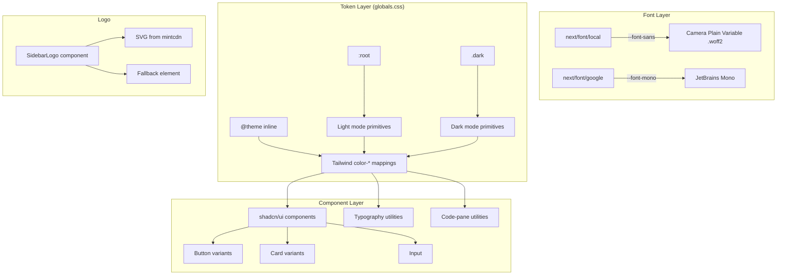

# Design Document: Lovable Design System Migration

## Overview

This design covers the migration of the CodelessShipMore application from the Cursor Design System (orange `#f54e00` primary, Inter font, warm canvas with timeline utilities) to a Lovable-inspired Design System (charcoal `#1c1c1c` primary, Camera Plain Variable font, cream `#f7f4ed` background with opacity-driven grays).

The migration is a CSS-first transformation. The application's component architecture (Next.js 16, shadcn/ui v4, Radix UI, next-themes) remains unchanged. The work targets three layers:

1. **Font loading** — Replace `next/font/google` Inter with a self-hosted Camera Plain Variable via `next/font/local`
2. **Token layer** — Rewrite CSS custom properties in `globals.css` under `@theme inline`, `:root`, and `.dark` selectors
3. **Component styling** — Update shadcn component variants (button, card, input) and replace Cursor-specific utilities with Lovable equivalents

The sidebar logo is the only structural component change — swapping the orange circle/asterisk for an SVG loaded from mintcdn.

### Key Design Decisions

| Decision | Rationale |
|----------|-----------|
| Self-host font via `next/font/local` | Camera Plain Variable is not on Google Fonts; `next/font/local` provides the same CSS variable injection, font-display control, and preload optimization as `next/font/google` |
| Keep `@theme inline` architecture | Tailwind CSS v4 inline config is already in place; changing to a config file would be a regression |
| Opacity-driven gray scale | Matches DESIGN.md specification; all neutrals derive from `#1c1c1c` at varying opacities for tonal unity |
| Retain shadcn token names | Keeps all shadcn/ui components working without component-level overrides — only the token values change |
| Inset shadow as CSS custom property | Reusable across button variants without repetition in Tailwind classes |
| Dark mode: warm charcoal, not pure black | Matches the Lovable brand warmth; derived by shifting the charcoal hue into warm territory at low lightness |

## Architecture



### File Change Map

| File | Change Type | Description |
|------|-------------|-------------|
| `src/app/layout.tsx` | Modify | Replace `Inter` import with `localFont` for Camera Plain Variable; update CSS variable name |
| `src/app/globals.css` | Rewrite | New token values, new typography utilities, remove Cursor utilities |
| `src/components/ui/button.tsx` | Modify | Update variant classes for Lovable palette + inset shadow |
| `src/components/ui/card.tsx` | Modify | Simplify variants, remove `claude`/`dark` naming, apply Lovable border style |
| `src/components/ui/input.tsx` | Modify | Update classes for Lovable border/focus style |
| `src/components/layout/sidebar.tsx` | Modify | Replace logo element with new `SidebarLogo` component |
| `src/components/layout/sidebar-logo.tsx` | Create | New component for SVG logo with fallback |
| `public/fonts/CameraPlainVariable.woff2` | Create | Self-hosted font file |

## Components and Interfaces

### 1. Font Loader (`src/app/layout.tsx`)

```typescript
import localFont from "next/font/local";
import { JetBrains_Mono } from "next/font/google";

const cameraPlain = localFont({
  src: "../../public/fonts/CameraPlainVariable.woff2",
  variable: "--font-sans",
  display: "swap",
  weight: "400 600",
  fallback: [
    "ui-sans-serif",
    "system-ui",
    "-apple-system",
    "BlinkMacSystemFont",
    "Segoe UI",
    "sans-serif",
  ],
});

const jetBrainsMono = JetBrains_Mono({
  subsets: ["latin"],
  variable: "--font-mono",
  weight: ["400", "500", "600"],
});
```

**Key changes:**
- `next/font/local` replaces `next/font/google` for the primary font
- CSS variable changes from `--font-inter` to `--font-sans` (direct mapping, no intermediate variable needed)
- `font-display: swap` ensures text remains visible during font load
- Weight axis `"400 600"` enables the 400, 480, and 600 weights specified in DESIGN.md
- The `--font-mono` variable name changes from `--font-code` to `--font-mono` for clarity

### 2. Token Layer (`globals.css` — `@theme inline`)

The `@theme inline` block maps Tailwind utility classes to CSS custom properties. The structure remains identical but values change:

```css
@theme inline {
    /* shadcn semantic surface */
    --color-background: var(--background);
    --color-foreground: var(--foreground);
    --color-primary: var(--primary);
    --color-primary-foreground: var(--primary-foreground);
    /* ... all existing shadcn mappings preserved ... */

    /* Fonts */
    --font-sans: var(--font-sans);
    --font-mono: var(--font-mono);

    /* Lovable primitives */
    --color-ink: var(--ink);
    --color-body: var(--body);
    --color-canvas: var(--canvas);

    /* Radius scale (unchanged values) */
    --radius-xs: 4px;
    --radius-sm: 6px;
    --radius-md: 8px;
    --radius-lg: 12px;
    --radius-xl: 16px;
    --radius-pill: 9999px;
}
```

### 3. Light Mode Primitives (`:root`)

```css
:root {
    /* Lovable primitives — light */
    --canvas: #f7f4ed;
    --ink: #1c1c1c;
    --body: #5f5f5d;
    --on-primary: #fcfbf8;
    --primary: #1c1c1c;
    --hairline: #eceae4;
    --hairline-strong: rgba(28, 28, 28, 0.4);
    --surface-card: #f7f4ed;
    --surface-strong: rgba(28, 28, 28, 0.04);
    --muted-fg: #5f5f5d;

    /* Opacity gray scale */
    --gray-3: rgba(28, 28, 28, 0.03);
    --gray-4: rgba(28, 28, 28, 0.04);
    --gray-40: rgba(28, 28, 28, 0.4);
    --gray-82: rgba(28, 28, 28, 0.82);
    --gray-83: rgba(28, 28, 28, 0.83);
    --gray-100: #1c1c1c;

    /* Shadows */
    --shadow-inset: rgba(255,255,255,0.2) 0px 0.5px 0px 0px inset,
                    rgba(0,0,0,0.2) 0px 0px 0px 0.5px inset,
                    rgba(0,0,0,0.05) 0px 1px 2px 0px;
    --shadow-focus: rgba(0, 0, 0, 0.1) 0px 4px 12px;

    /* shadcn semantic — light */
    --background: #f7f4ed;
    --foreground: #1c1c1c;
    --card: #f7f4ed;
    --card-foreground: #1c1c1c;
    --popover: #ffffff;
    --popover-foreground: #1c1c1c;
    --primary-foreground: #fcfbf8;
    --secondary: #f7f4ed;
    --secondary-foreground: #1c1c1c;
    --muted: rgba(28, 28, 28, 0.03);
    --muted-foreground: #5f5f5d;
    --accent: rgba(28, 28, 28, 0.04);
    --accent-foreground: #1c1c1c;
    --destructive: #dc2626;
    --border: #eceae4;
    --input: #eceae4;
    --ring: rgba(59, 130, 246, 0.5);

    /* Sidebar */
    --sidebar: #f7f4ed;
    --sidebar-foreground: #5f5f5d;
    --sidebar-primary: #1c1c1c;
    --sidebar-primary-foreground: #fcfbf8;
    --sidebar-accent: rgba(28, 28, 28, 0.04);
    --sidebar-accent-foreground: #1c1c1c;
    --sidebar-border: #eceae4;
    --sidebar-ring: rgba(59, 130, 246, 0.5);
}
```

### 4. Dark Mode Primitives (`.dark`)

Strategy: Invert the cream/charcoal relationship. Canvas becomes warm dark (`hsl(45, 10%, 10%)` ≈ `#1c1a16`), ink becomes cream-white. Borders use cream at low opacity.

```css
.dark {
    --canvas: #1c1a16;
    --ink: #f7f7f4;
    --body: #d4d2cc;
    --on-primary: #1c1c1c;
    --primary: #f7f4ed;
    --hairline: rgba(247, 244, 237, 0.10);
    --hairline-strong: rgba(247, 244, 237, 0.18);
    --surface-card: #242219;
    --surface-strong: rgba(247, 244, 237, 0.06);
    --muted-fg: #a8a59c;

    /* shadcn semantic — dark */
    --background: #1c1a16;
    --foreground: #f7f4ed;
    --card: #242219;
    --card-foreground: #f7f7f4;
    --popover: #242219;
    --popover-foreground: #f7f7f4;
    --primary-foreground: #1c1c1c;
    --secondary: #242219;
    --secondary-foreground: #f7f7f4;
    --muted: rgba(247, 244, 237, 0.06);
    --muted-foreground: #a8a59c;
    --accent: rgba(247, 244, 237, 0.06);
    --accent-foreground: #f7f7f4;
    --destructive: #ef4444;
    --border: rgba(247, 244, 237, 0.10);
    --input: rgba(247, 244, 237, 0.10);
    --ring: rgba(59, 130, 246, 0.5);

    /* Sidebar */
    --sidebar: #1c1a16;
    --sidebar-foreground: #d4d2cc;
    --sidebar-accent: rgba(247, 244, 237, 0.06);
    --sidebar-accent-foreground: #f7f7f4;
    --sidebar-border: rgba(247, 244, 237, 0.10);
}
```

**Dark mode derivation logic:**
- Canvas: `hsl(45, 10%, 10%)` — warm hue (45°), low saturation, 10% lightness
- Card surface: `hsl(45, 12%, 13%)` — 3% lighter than canvas for visible distinction
- Body text: `#d4d2cc` — contrast ratio ~10:1 against canvas (exceeds 4.5:1)
- Muted foreground: `#a8a59c` — contrast ratio ~5:1 against canvas (exceeds 3:1)
- Borders: cream `#f7f4ed` at 0.06/0.10/0.18 opacity (soft/default/strong)

### 5. Button Component (`src/components/ui/button.tsx`)

Updated variant map:

```typescript
const buttonVariants = cva(
  "cursor-pointer rounded-sm text-base font-normal leading-normal inline-flex items-center justify-center whitespace-nowrap transition-[opacity,box-shadow] disabled:pointer-events-none disabled:opacity-50 [&_svg:not([class*='size-'])]:size-4 [&_svg]:pointer-events-none shrink-0 [&_svg]:shrink-0 outline-none select-none focus-visible:shadow-[var(--shadow-focus)]",
  {
    variants: {
      variant: {
        default:
          "bg-primary text-primary-foreground shadow-[var(--shadow-inset)] hover:opacity-90 active:opacity-80",
        outline:
          "bg-transparent text-foreground border border-[rgba(28,28,28,0.4)] hover:opacity-90 active:opacity-80",
        secondary:
          "bg-background text-foreground hover:opacity-90 active:opacity-80",
        ghost:
          "hover:bg-accent hover:text-accent-foreground active:opacity-80",
        destructive:
          "bg-destructive text-white hover:opacity-90 active:opacity-80",
        link:
          "text-foreground underline-offset-4 hover:underline",
        pill:
          "bg-primary text-primary-foreground rounded-full shadow-[var(--shadow-inset)] hover:opacity-90 active:opacity-80",
      },
      size: {
        default: "h-10 gap-2 px-4 py-2",
        sm: "h-8 gap-1.5 px-3 py-1.5 text-sm",
        lg: "h-11 gap-2 px-6 py-2",
        icon: "size-9 rounded-full",
      },
    },
    defaultVariants: {
      variant: "default",
      size: "default",
    },
  }
);
```

### 6. Card Component (`src/components/ui/card.tsx`)

```typescript
const cardVariants = cva(
  "gap-4 overflow-hidden text-sm group/card flex flex-col bg-card text-card-foreground border border-border rounded-lg py-6",
  {
    variants: {
      size: {
        default: "",
        sm: "gap-3 py-4",
        featured: "rounded-xl",
        compact: "rounded-md",
      },
    },
    defaultVariants: {
      size: "default",
    },
  }
);
```

Key changes:
- No box-shadow on any variant
- Border uses `border-border` (resolves to `#eceae4` light / `rgba(247,244,237,0.10)` dark)
- Radius variants: `rounded-lg` (12px) default, `rounded-xl` (16px) featured, `rounded-md` (8px) compact
- Remove `claude` and `dark` variant names — replaced by semantic `size` variants

### 7. Input Component (`src/components/ui/input.tsx`)

```typescript
className={cn(
  "bg-background text-foreground border border-border rounded-sm px-3 py-2 text-base placeholder:text-muted-foreground focus-visible:outline-2 focus-visible:outline-[rgba(59,130,246,0.5)] focus-visible:outline-offset-2 disabled:pointer-events-none disabled:opacity-50 w-full min-w-0 transition-colors",
  className
)}
```

### 8. SidebarLogo Component (`src/components/layout/sidebar-logo.tsx`)

```typescript
interface SidebarLogoProps {
  collapsed: boolean;
}

export function SidebarLogo({ collapsed }: SidebarLogoProps) {
  const [error, setError] = useState(false);
  const logoUrl =
    "https://mintcdn.com/supermemory/1szAHJ3-ym4bjQ4U/logo/light.svg?fit=max&auto=format&n=1szAHJ3-ym4bjQ4U&q=85&s=e4571d11b31900b962a200bf7206e7d9";

  if (error) {
    return (
      <div
        className="h-7 w-7 rounded-sm bg-foreground/10"
        aria-label="CodelessShipMore logo"
      />
    );
  }

  return (
     setError(true)}
    />
  );
}
```

### 9. Typography Utilities (in `globals.css` `@layer utilities`)

```css
@layer utilities {
    .text-display-hero {
        font-size: 60px;
        font-weight: 600;
        line-height: 1.1;
        letter-spacing: -1.5px;
    }
    .text-display-section {
        font-size: 48px;
        font-weight: 600;
        line-height: 1.0;
        letter-spacing: -1.2px;
    }
    .text-display-sub {
        font-size: 36px;
        font-weight: 600;
        line-height: 1.1;
        letter-spacing: -0.9px;
    }
    .text-card-title {
        font-size: 20px;
        font-weight: 400;
        line-height: 1.25;
        letter-spacing: 0px;
    }
    .text-body {
        font-size: 16px;
        font-weight: 400;
        line-height: 1.5;
        letter-spacing: 0px;
    }
    .text-button {
        font-size: 16px;
        font-weight: 400;
        line-height: 1.5;
        letter-spacing: 0px;
    }
    .text-caption {
        font-size: 14px;
        font-weight: 400;
        line-height: 1.5;
        letter-spacing: 0px;
    }
    /* Code pane — Lovable equivalent */
    .code-pane {
        background-color: var(--background);
        color: var(--foreground);
        font-family: var(--font-mono), "JetBrains Mono", monospace;
        font-size: 0.8125rem;
        line-height: 1.5;
        border: 1px solid var(--border);
        border-radius: 6px;
        padding: 16px;
    }
    .code-pane-editable {
        background-color: var(--background);
        color: var(--foreground);
        font-family: var(--font-mono), "JetBrains Mono", monospace;
        font-size: 0.8125rem;
        line-height: 1.5;
        border: 1px solid var(--border);
        border-radius: 6px;
        padding: 16px;
        caret-color: var(--foreground);
    }
    .code-pane-editable:focus {
        outline: 2px solid rgba(59, 130, 246, 0.5);
        outline-offset: 2px;
    }
}
```

### 10. Utility Class Migration Map

| Cursor Utility | Lovable Replacement | Notes |
|----------------|---------------------|-------|
| `.text-display-mega` | `.text-display-hero` | 72px → 60px, weight 400 → 600 |
| `.text-display-lg` | `.text-display-section` | 36px → 48px |
| `.text-display-md` | `.text-display-sub` | 26px → 36px |
| `.text-display-sm` | `.text-card-title` | 22px → 20px |
| `.text-title-md` | Removed | Use `.text-card-title` or Tailwind `text-lg font-semibold` |
| `.text-title-sm` | Removed | Use Tailwind `text-base font-semibold` |
| `.text-body-md` | `.text-body` | Same size, simplified name |
| `.text-body-sm` | `.text-caption` | 14px |
| `.text-caption-uppercase` | Removed | Not in Lovable spec |
| `.text-code` | Use `.code-pane` or `font-mono` | Simplified |
| `.text-nav-link` | Removed | Use `.text-caption` |
| `.timeline-pill*` | Removed entirely | No equivalent in Lovable |
| `.code-pane` | `.code-pane` (restyled) | Same class name, new values |
| `.code-pane-editable` | `.code-pane-editable` (restyled) | Same class name, new values |

## Data Models

This migration does not introduce new data models. The changes are purely presentational (CSS custom properties, font files, component class strings). No database schemas, API contracts, or state management structures are affected.

The only "data" involved is:
- **Font file**: `CameraPlainVariable.woff2` — a static binary asset placed in `public/fonts/`
- **SVG logo**: Loaded at runtime from an external URL (mintcdn), with a static fallback element

## Error Handling

| Scenario | Handling Strategy |
|----------|-------------------|
| Camera Plain Variable fails to load | `font-display: swap` ensures text renders immediately with fallback stack (`ui-sans-serif, system-ui, ...`). CLS target: ≤ 0.05 |
| Logo SVG fails to load from mintcdn | `onError` handler in `SidebarLogo` renders a neutral placeholder `div` at the same dimensions |
| Component references removed Cursor token | Token is simply absent from CSS; components are updated in the same PR to use Lovable equivalents. No build errors because Tailwind utilities referencing undefined `--color-*` vars produce transparent/unset values gracefully |
| Dark mode token missing | All dark mode tokens are defined in the `.dark` selector; the theme engine (`next-themes` with `attribute="class"`) toggles the class on `<html>`, which is unchanged |
| Removed utility class still referenced | The migration updates all component files that use removed classes (identified via grep). The build will fail on any Tailwind class that references a removed `@theme inline` mapping, catching regressions at build time |

## Correctness Properties

### Property 1: Token Completeness

Every shadcn semantic token (`--background`, `--foreground`, `--primary`, `--primary-foreground`, `--border`, `--card`, `--card-foreground`, `--popover`, `--popover-foreground`, `--muted`, `--muted-foreground`, `--accent`, `--accent-foreground`, `--destructive`, `--input`, `--ring`) resolves to a defined value in both `:root` and `.dark` selectors. No token referenced by a shadcn/ui component may be undefined.

**Validates: Requirements 9.1, 9.2, 9.3, 9.4, 9.5, 9.6, 9.7, 9.8, 9.9, 9.10, 9.11, 9.12**

### Property 2: Contrast Compliance

All text/background color pairs meet WCAG 2.1 AA minimum contrast ratios: body text (`#5f5f5d`) on background (`#f7f4ed`) achieves at least 4.5:1, primary text (`#1c1c1c`) on background (`#f7f4ed`) achieves at least 7:1, and dark mode equivalents maintain the same minimum ratios against their respective canvas values.

**Validates: Requirements 2.12, 3.2**

### Property 3: Migration Completeness

Zero references to removed Cursor-specific tokens (`--timeline-thinking`, `--timeline-grep`, `--timeline-read`, `--timeline-edit`, `--timeline-done`, `--primary-active`, `--ink-elevated`, `--ink-soft`) or removed utility classes (`.timeline-pill*`) remain in any `.tsx` or `.css` file after migration.

**Validates: Requirements 11.4, 11.5, 11.6, 2.10**

### Property 4: Build Integrity

The application compiles successfully via `next build` without errors or Tailwind warnings about undefined theme values after all token and utility changes are applied.

**Validates: Requirements 2.13**

### Property 5: Font Fallback Resilience

When Camera Plain Variable is unavailable, text renders immediately using the defined fallback stack (`ui-sans-serif, system-ui, -apple-system, BlinkMacSystemFont, "Segoe UI", sans-serif`) with a Cumulative Layout Shift of no more than 0.05.

**Validates: Requirements 1.5**

## Testing Strategy

### Unit Tests (Example-Based)
- Verify font CSS variable is applied to `<html>` element
- Verify light/dark mode token values resolve correctly
- Verify button variants render correct classes
- Verify logo fallback renders when image fails
- Verify no references to removed Cursor utilities remain in the codebase

### Visual Regression Tests
- Screenshot comparison of key pages (home, JSON viewer, settings) in light and dark mode
- Compare button, card, and input rendering against DESIGN.md specifications

### Accessibility Tests
- WCAG 2.1 AA contrast ratio verification:
  - `#f7f4ed` background + `#5f5f5d` body text ≥ 4.5:1 (actual: ~4.74:1)
  - `#f7f4ed` background + `#1c1c1c` primary text ≥ 7:1 (actual: ~14.5:1)
  - Dark mode body text against dark canvas ≥ 4.5:1
  - Dark mode muted foreground against dark canvas ≥ 3:1
- Focus indicator visibility (2px outline with offset)
- Font fallback CLS measurement

### Integration Tests
- Full page render in light mode — no missing styles or broken layouts
- Full page render in dark mode — all tokens resolve
- Theme toggle transitions smoothly between modes
- Sidebar collapsed/expanded states render logo correctly

### Migration Completeness Check
- Grep for removed class names across all `.tsx` files — expect zero matches
- Grep for removed CSS custom properties in `globals.css` — expect zero matches
- Build succeeds with no Tailwind warnings about undefined theme values

### Why Property-Based Testing Does Not Apply

This migration is a **CSS/styling transformation** — it changes visual token values and component class strings. The work involves:
- Declarative CSS custom property definitions (no logic, no input/output functions)
- Static class string updates in React components
- A font file swap (binary asset)
- An SVG image URL change

There are no pure functions with variable input spaces, no parsers, no serializers, no algorithms, and no business logic being modified. The correctness of this migration is best verified through:
- Visual regression testing (screenshot comparison)
- Static analysis (grep for removed tokens/classes)
- Contrast ratio calculation (fixed input pairs, not variable)
- Build verification (Tailwind compilation succeeds)

Property-based testing would not provide meaningful coverage for these changes.
