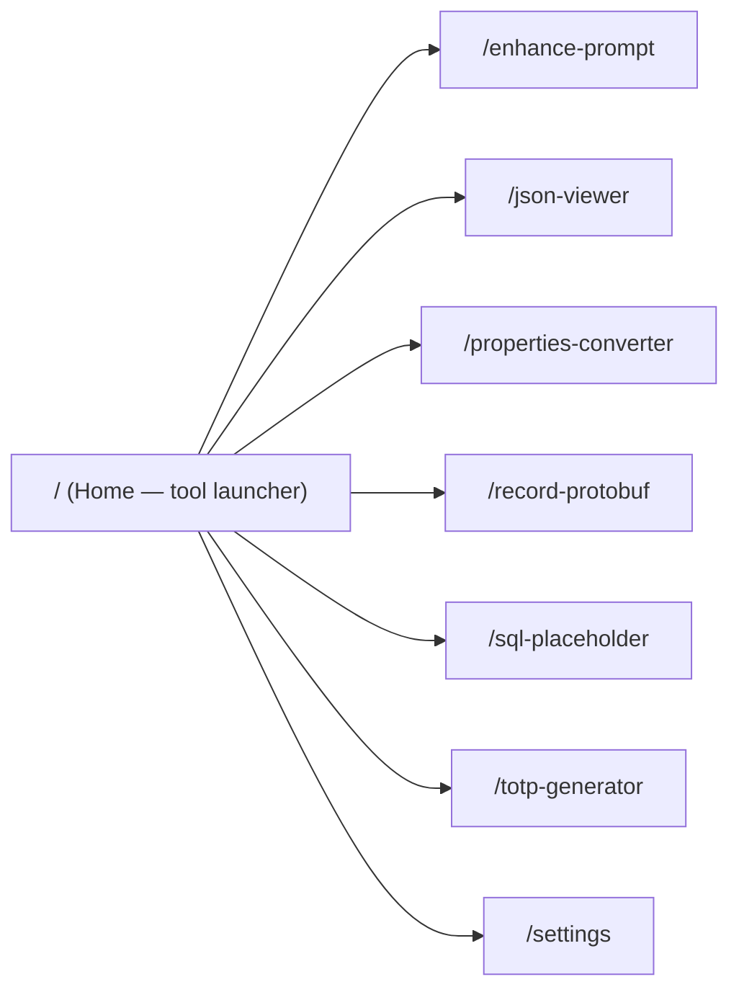
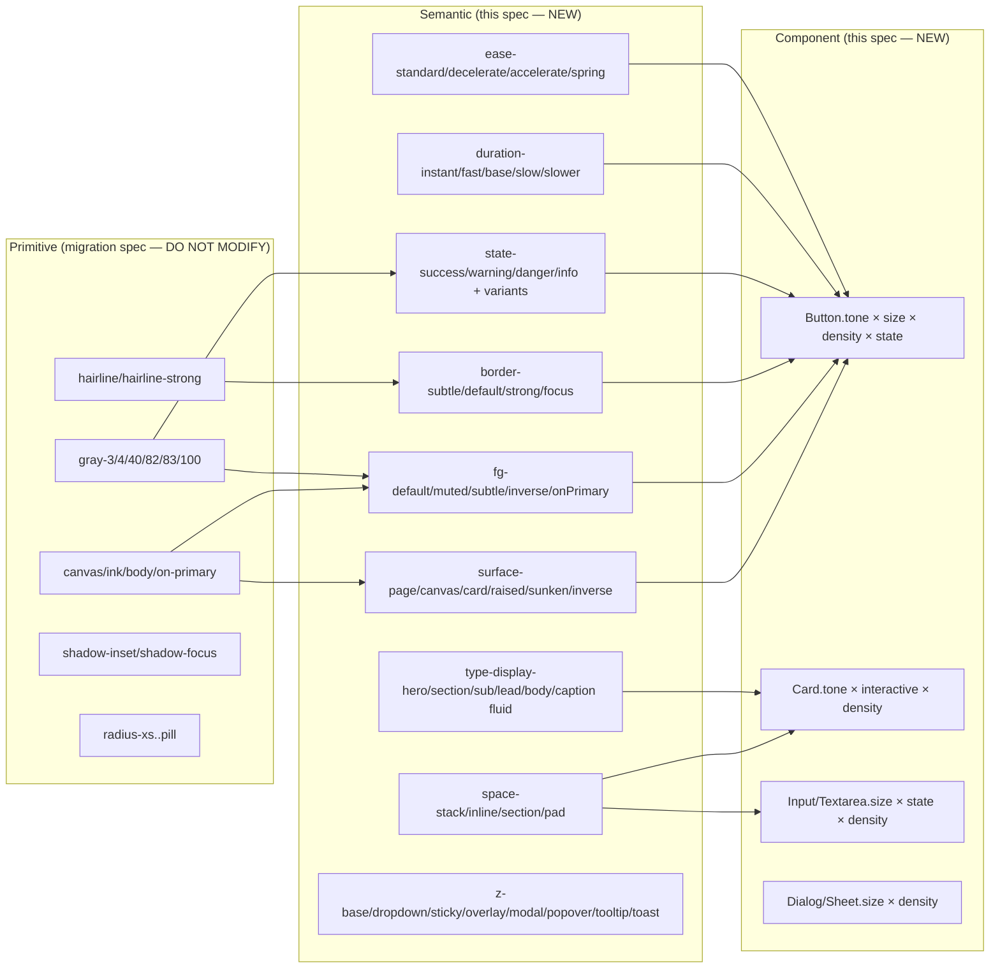
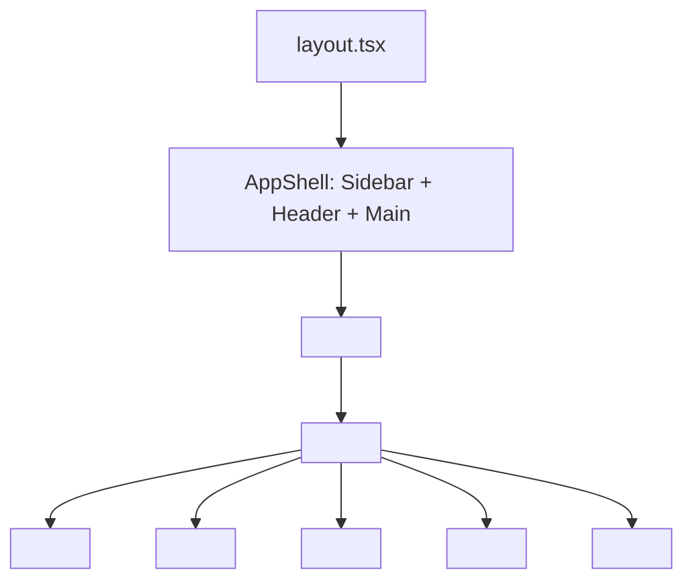
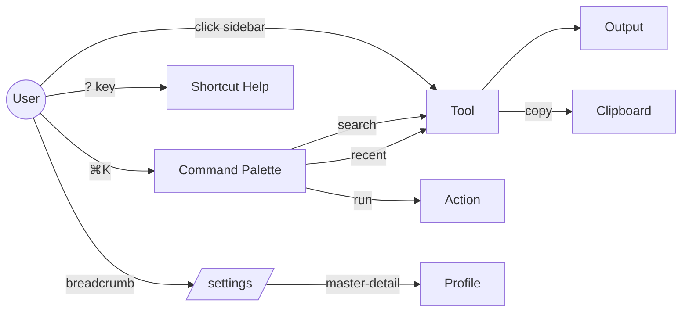

# Design Document: UI/UX Redesign

## 1. Overview

### 1.1 Scope

This redesign builds on the visual language defined in `DESIGN.md` and shipped via the `lovable-design-system-migration` spec. The migration delivered the foundational primitive tokens, font, and one-to-one component swaps. This spec layers UX craft on top: a semantic token layer, fluid typography, layout primitives, a motion system, an accessibility model, an interaction state matrix, form UX patterns, and page-level redesigns for the highest-traffic routes.

### 1.2 Goals

- Preserve the warm cream-and-charcoal Lovable aesthetic exactly as DESIGN.md specifies.
- Add a semantic token layer that maps existing primitives to UX-meaningful names.
- Make every component state legible (default, hover, active, focus-visible, disabled, loading, error, success).
- Make navigation faster: command palette, keyboard map, scroll-spy, breadcrumbs.
- Make tools feel cohesive with a shared `ToolShell` template instead of seven different layouts.
- Reach WCAG 2.1 AA on all text and 3:1 on all non-text UI in both light and dark.
- Honor `prefers-reduced-motion` everywhere.

### 1.3 Non-Goals

- Replacing the visual language. Cream `#f7f4ed`, charcoal `#1c1c1c`, Camera Plain Variable, opacity grays, `#eceae4` borders, inset shadows are immutable.
- Replacing shadcn/ui or Radix. We extend, never fork.
- Server-side data, auth providers, AI provider features, or storage architecture (per `ARCHITECTURE.md`).
- Multi-tenant theming (we leave a hook for it but do not build it).

### 1.4 Relationship to `lovable-design-system-migration`

| Owned by migration spec (do not redo) | Owned by this spec (new) |
|---|---|
| Camera Plain Variable font loader | Semantic token layer over primitives |
| Primitive color tokens (`--canvas`, `--ink`, `--body`, gray-3..gray-100) | Fluid type ramps with `clamp()` |
| Shadow tokens (`--shadow-inset`, `--shadow-focus`) | Motion tokens (durations, easings, patterns) |
| Radius scale (`--radius-xs..pill`) | Layout primitives (`Stack`, `Cluster`, `Grid`, `Center`, `Section`, `Prose`, `ToolShell`) |
| shadcn semantic mapping (`--background`, `--foreground`, etc.) | State-color tokens (`--state-success/warning/danger/info`) |
| Light + dark `:root` / `.dark` blocks | Density modes (`data-density="comfortable\|compact"`) |
| Button, Card, Input variant swap | Component state matrix for every shadcn family |
| Sidebar logo swap | Command palette, keyboard map, breadcrumbs, scroll-spy |
| Cursor utility removal | Focus-ring utility, form UX library, save-state machine |
| Typography utilities (display-hero/section/sub, card-title, body, button, caption) | Page redesigns: Home, Settings, JSON Viewer, Enhance Prompt |

### 1.5 Success Metrics

| Metric | Target |
|---|---|
| WCAG AA contrast pass rate (text-on-bg) | 100% |
| WCAG non-text contrast (UI ≥ 3:1) | 100% |
| Keyboard-only completion of every primary user flow | 100% |
| `prefers-reduced-motion: reduce` honored on every animated element | 100% |
| Touch target size on `pointer: coarse` | ≥ 44 × 44 px |
| LCP (75th percentile) on home, json-viewer, settings | ≤ 2.0 s |
| INP (75th percentile) | ≤ 200 ms |
| CLS | ≤ 0.05 |
| Tool-switch via command palette | ≤ 2 keystrokes after `⌘K` |

## 2. Audit (Current State)

### 2.1 Route Map and IA



Currently each tool is reachable only from the sidebar. There is no command palette, no recently-used list, no quick-search. The Home page is undifferentiated from a sidebar entry.

### 2.2 Token Audit

`globals.css` currently exposes:

| Layer | Status | Gap |
|---|---|---|
| Primitive colors (canvas, ink, body, on-primary, hairline, gray-3..gray-100) | ✅ Present | — |
| Shadcn semantic (background, foreground, card, primary, etc.) | ✅ Present | — |
| Sidebar tokens | ✅ Present | — |
| Shadow (`--shadow-inset`, `--shadow-focus`) | ✅ Present | — |
| Radius (`--radius-xs..pill`) | ✅ Present | — |
| Font (`--font-sans`, `--font-mono`) | ✅ Present | — |
| Typography utilities (display-hero/section/sub, card-title, body, button, caption) | ✅ Present | Fixed px sizes, not fluid |
| **Spacing semantic layer** | ❌ Missing | Need `--space-stack-*`, `--space-inline-*`, `--space-section-*`, `--space-pad-*` |
| **State colors** (success/warning/danger/info) | ❌ Partial | Only `--destructive` exists; need full state set tuned to warm-neutral identity |
| **Surface roles** (page/canvas/card/raised/sunken/inverse) | ❌ Partial | `--card` exists, `--surface-card`/`--surface-strong` exist, but no `--surface-raised`/`--surface-sunken`/`--surface-inverse` |
| **Border roles** (subtle/default/strong/focus) | ❌ Partial | `--border` and `--hairline-strong` exist, no `--border-focus` |
| **Foreground roles** (default/muted/subtle/inverse/onPrimary) | ❌ Partial | `--foreground`, `--muted-foreground`, `--on-primary` exist, no `--fg-subtle` |
| **Motion** (durations, easings) | ❌ Missing | Only `transition-colors duration-150` in base layer |
| **Density mode** | ❌ Missing | No `data-density` system |
| **Selection / kbd / link / inline-code tokens** | ❌ Missing | No semantic tokens for these surfaces |
| **Z-index scale** | ❌ Missing | Implicit through Radix portal layering only |

### 2.3 Component Coverage

| Component | Variants today | State matrix gap |
|---|---|---|
| Button | default / outline / secondary / ghost / destructive / link / pill | No loading state; no `tone` axis (success/warning/danger as variants); no `density` axis |
| Card | default / sm / featured / compact | No `tone`, no interactive (clickable) variant, no skeleton variant |
| Input | single | No size variants; no leading/trailing icon slots in the primitive (input-group exists separately); no error/success state |
| Textarea | single | Same gaps as Input; no autosize variant |
| Select / Combobox | shadcn defaults | No async-loading, no virtualization guidance |
| Dialog / Sheet | shadcn defaults | No size scale (sm/md/lg/xl/full); no scroll-lock behavior documented |
| Tooltip | shadcn defaults | No `delayDuration` token |
| Toast (sonner) | sonner defaults | No tone-mapping to state colors |
| Tabs | shadcn defaults | No `density`, no scroll-on-overflow guidance |
| Skeleton | single | No semantic shapes (text-line, avatar, card) |
| Toggle / ToggleGroup | shadcn defaults | No density |
| Sidebar (custom) | collapsed / expanded | No keyboard-shortcut hints, no scroll-spy |
| Notifications popover | custom | No empty state, no skeletons |
| ProviderCard / ProfileList (settings) | custom | No master-detail keyboard nav, no command-palette hooks |

### 2.4 Accessibility Baseline Gaps

- No global skip-to-content link.
- No documented landmark regions.
- Focus rings exist (`outline-ring/50`) but not consistently applied via `:focus-visible`.
- No `prefers-reduced-motion` media query in CSS.
- No `?` shortcut help. No `⌘K` palette.
- Color is currently the only signal for some states (e.g. profile "active" badge).

### 2.5 Motion Baseline Gaps

- Only `transition-colors duration-150` is global.
- `framer-motion` is installed but unused as a system.
- No motion variants library, no `MotionConfig reducedMotion="user"` wrapper.

## 3. High-Level Design

### 3.1 Token Architecture



Three layers:

1. **Primitive** — raw values from DESIGN.md (owned by migration spec, frozen).
2. **Semantic** — UX role names that map onto primitives. Components consume only this layer.
3. **Component** — variant maps (shadcn `cva`) that resolve semantic tokens.

This separation lets us tune visuals without touching components, and add tenant themes later by swapping the semantic layer only.

### 3.2 Theming Model

- Light and dark already exist via `next-themes` and `.dark` class. Keep that mechanism.
- Add `data-theme` as an alternative escape hatch for future tenant skins (`<html data-theme="brand-foo">`). The semantic layer is duplicated under each `[data-theme="..."]` block when needed; primitives stay shared.
- Theme transition: 150 ms ease-in-out on `color`, `background-color`, `border-color`, `box-shadow`, `outline-color`. Never on layout properties (`width`, `height`, `padding`, `margin`).
- `MotionConfig` from framer-motion wraps the root layout with `reducedMotion="user"`.

### 3.3 Layout System



Seven primitives cover ≥ 95% of layout needs. They render plain `div`s with token-driven `gap`, `padding`, and `max-width`. They expose escape hatches via `className`. They are deliberately small.

### 3.4 Navigation & IA



- **Sidebar** stays as primary navigation. Add keyboard-shortcut hints next to each item (e.g. `g j` for json-viewer).
- **Command Palette** (`⌘K` / `Ctrl+K`) — searches tools, recent items, and registered actions. Built on `cmdk` (already a transitive dep via shadcn) or shadcn `command`. Lives in a Radix Dialog.
- **Breadcrumbs** appear on `/settings/*` (master-detail) and any future nested route.
- **Scroll-spy** on long single-pages (none today; placeholder for future docs).
- **Recently used** list on Home and in palette; persisted in `localStorage` per existing storage convention.
- **Keyboard map** documented and exposed via `?`.

### 3.5 Motion System

| Token | Value | Use |
|---|---|---|
| `--duration-instant` | 75 ms | Color flips, hover tints |
| `--duration-fast` | 150 ms | Default UI transitions, theme switch |
| `--duration-base` | 200 ms | Popovers, tooltips |
| `--duration-slow` | 300 ms | Dialogs, sheets, drawer enter |
| `--duration-slower` | 500 ms | Hero entrance, large list stagger |
| `--ease-standard` | `cubic-bezier(0.2, 0, 0, 1)` | Most transitions |
| `--ease-decelerate` | `cubic-bezier(0, 0, 0.2, 1)` | Enter |
| `--ease-accelerate` | `cubic-bezier(0.4, 0, 1, 1)` | Exit |
| `--ease-spring` | n/a (framer-motion only) | `{ type: "spring", stiffness: 320, damping: 28 }` |

Pattern catalog:

| Pattern | Element | Recipe |
|---|---|---|
| Hover lift | Button, Card-interactive | `translate-y-[-1px]` + `--duration-instant` |
| Pressed | Button, Toggle | `scale-[0.98]` + `--duration-instant` |
| Enter | Dialog, Sheet, Popover, Toast | opacity 0→1 + translateY(8px→0) + `--duration-base` `--ease-decelerate` |
| Exit | same | reverse + `--duration-fast` `--ease-accelerate` |
| Skeleton shimmer | Skeleton | linear-gradient sweep, `--duration-slower` infinite |
| Focus ring fade-in | All focusables | `--shadow-focus` + `--duration-fast` |
| Toast | sonner | slide+fade per sonner defaults, mapped to motion tokens |
| Sheet | shadcn Sheet | slide from edge + `--duration-slow` `--ease-decelerate` |

`prefers-reduced-motion: reduce` policy: replace movement (translate, scale) with opacity-only fade at `--duration-instant`. Skeleton shimmer becomes a static muted bg.

### 3.6 Accessibility Model

- **Focus-ring utility** `.focus-ring`: applies `--shadow-focus` on `:focus-visible` only. Every interactive element either uses Radix (which already handles this) or composes `.focus-ring`.
- **Keyboard map**:
  - `⌘K` / `Ctrl+K`: command palette
  - `?`: shortcut help dialog
  - `g h`: home, `g s`: settings, `g j`: json-viewer, `g e`: enhance-prompt, `g p`: properties-converter, `g r`: record-protobuf, `g q`: sql-placeholder, `g t`: totp-generator
  - `[` / `]`: collapse / expand sidebar
  - `Esc`: close palette / dialog / sheet / popover
  - In ToolShell: `⌘ Enter` runs primary action, `⌘ ⇧ C` copies output, `⌘ ⇧ K` clears input
- **Landmarks**: `<a class="sr-only focus:not-sr-only">` skip-to-content first; `<nav aria-label="Primary">` for sidebar; `<main id="main">` per page; `<aside aria-label="Tool Output">` for ToolShell right pane.
- **ARIA**: rely on Radix patterns. For custom (sidebar, notifications-popover, ProviderCard), audit per `https://www.w3.org/WAI/ARIA/apg/patterns/` and document the chosen pattern.
- **Color-only signals**: every state token pairs with an icon (Tabler icons): success `IconCheck`, warning `IconAlertTriangle`, danger `IconAlertCircle`, info `IconInfoCircle`.
- **Touch targets**: `@media (pointer: coarse) { .target-sm { min-h-[44px] min-w-[44px]; } }` applied to `Button.size="sm"` and `IconButton`.

### 3.7 Content Patterns

- **Prose**: `<Prose>` renders long-form text with measure ≤ 65 ch, paragraph spacing `--space-stack-md`, list/blockquote/code styles inheriting tokens.
- **ToolShell**: `<ToolShell title description actions left right footer>` is the canonical two-pane layout. Every utility tool migrates to it.
- **EmptyState**: `<EmptyState icon title description action>` with consistent vertical centering, muted foreground, optional CTA.
- **ErrorState**: `<ErrorState icon title description retry>` similar shape, tone-mapped to `--state-danger-fg`.
- **Loading**: skeleton primitives composed from `<Skeleton>`; never a spinner unless duration > 1 s.

## 4. Low-Level Design

### 4.1 Semantic Token Specification

Add to `globals.css` after the existing primitive block. All values reference primitives or are derived. Light + dark parity required.

```css
:root {
  /* Surfaces */
  --surface-page: var(--canvas);                 /* #f7f4ed */
  --surface-canvas: var(--canvas);
  --surface-card: var(--canvas);
  --surface-raised: #fdfcf6;                     /* +1 step lighter for popover/dialog */
  --surface-sunken: rgba(28, 28, 28, 0.03);     /* gray-3 */
  --surface-inverse: var(--ink);                 /* #1c1c1c */
  --surface-inverse-fg: var(--on-primary);       /* #fcfbf8 */

  /* Foreground roles */
  --fg-default: var(--ink);                      /* #1c1c1c */
  --fg-muted: var(--body);                       /* #5f5f5d */
  --fg-subtle: rgba(28, 28, 28, 0.4);           /* gray-40 */
  --fg-inverse: var(--on-primary);
  --fg-on-primary: var(--on-primary);

  /* Border roles */
  --border-subtle: var(--hairline);              /* #eceae4 */
  --border-default: var(--hairline);
  --border-strong: var(--hairline-strong);       /* rgba(28,28,28,0.4) */
  --border-focus: rgba(59, 130, 246, 0.5);

  /* State colors — warm-neutral tuned, AA-verified */
  --state-success-fg: #3f5236;
  --state-success-bg-subtle: #e9efdf;
  --state-success-border: #b9c8a6;

  --state-warning-fg: #7a5418;
  --state-warning-bg-subtle: #f6ead0;
  --state-warning-border: #e0c789;

  --state-danger-fg: #8b2f24;
  --state-danger-bg-subtle: #f5dcd6;
  --state-danger-border: #e3a89c;

  --state-info-fg: #2f4458;
  --state-info-bg-subtle: #dde6ee;
  --state-info-border: #a9bccf;

  /* Selection, kbd, inline-code */
  --selection-bg: rgba(28, 28, 28, 0.12);
  --selection-fg: var(--ink);
  --kbd-bg: rgba(28, 28, 28, 0.04);
  --kbd-border: var(--hairline);
  --kbd-fg: var(--ink);
  --code-inline-bg: rgba(28, 28, 28, 0.04);
  --code-inline-fg: var(--ink);

  /* Spacing — semantic */
  --space-inline-xs: 4px;
  --space-inline-sm: 8px;
  --space-inline-md: 12px;
  --space-inline-lg: 16px;
  --space-stack-xs: 8px;
  --space-stack-sm: 12px;
  --space-stack-md: 16px;
  --space-stack-lg: 24px;
  --space-stack-xl: 32px;
  --space-stack-2xl: 48px;
  --space-section-sm: clamp(40px, 6vw, 64px);
  --space-section-md: clamp(56px, 8vw, 96px);
  --space-section-lg: clamp(80px, 10vw, 128px);
  --space-section-xl: clamp(96px, 14vw, 208px);
  --space-pad-x-card: 16px;
  --space-pad-y-card: 16px;
  --space-pad-x-section: clamp(16px, 4vw, 32px);
  --space-pad-y-section: clamp(40px, 8vw, 96px);
  --space-pad-x-page: clamp(16px, 4vw, 32px);

  /* Fluid type */
  --type-display-hero-size: clamp(40px, 5vw + 1rem, 60px);
  --type-display-hero-tracking: clamp(-1.5px, -0.05em, -0.5px);
  --type-display-section-size: clamp(32px, 4vw + 0.75rem, 48px);
  --type-display-section-tracking: clamp(-1.2px, -0.04em, -0.4px);
  --type-display-sub-size: clamp(24px, 3vw + 0.5rem, 36px);
  --type-display-sub-tracking: clamp(-0.9px, -0.03em, -0.2px);
  --type-card-title-size: 20px;
  --type-lead-size: 18px;
  --type-body-size: 16px;
  --type-caption-size: 14px;
  --type-code-size: 0.8125rem;
  --type-prose-measure: 65ch;

  /* Motion */
  --duration-instant: 75ms;
  --duration-fast: 150ms;
  --duration-base: 200ms;
  --duration-slow: 300ms;
  --duration-slower: 500ms;
  --ease-standard: cubic-bezier(0.2, 0, 0, 1);
  --ease-decelerate: cubic-bezier(0, 0, 0.2, 1);
  --ease-accelerate: cubic-bezier(0.4, 0, 1, 1);

  /* Z-index */
  --z-base: 0;
  --z-dropdown: 1000;
  --z-sticky: 1010;
  --z-overlay: 1020;
  --z-modal: 1030;
  --z-popover: 1040;
  --z-tooltip: 1050;
  --z-toast: 1060;
}
```

```css
.dark {
  --surface-page: var(--canvas);                 /* #1c1a16 */
  --surface-canvas: var(--canvas);
  --surface-card: var(--surface-card);           /* #242219 */
  --surface-raised: #2c2a20;
  --surface-sunken: rgba(247, 244, 237, 0.04);
  --surface-inverse: var(--on-primary);          /* light cream */
  --surface-inverse-fg: var(--ink);              /* #f7f7f4 */

  --fg-default: var(--ink);
  --fg-muted: var(--body);
  --fg-subtle: rgba(247, 244, 237, 0.45);
  --fg-inverse: var(--on-primary);
  --fg-on-primary: var(--on-primary);

  --border-subtle: rgba(247, 244, 237, 0.10);
  --border-default: rgba(247, 244, 237, 0.10);
  --border-strong: rgba(247, 244, 237, 0.25);
  --border-focus: rgba(59, 130, 246, 0.6);

  /* State colors — dark variants, warm-neutral tuned, AA on dark canvas */
  --state-success-fg: #b9d49b;
  --state-success-bg-subtle: rgba(155, 195, 121, 0.10);
  --state-success-border: rgba(155, 195, 121, 0.30);

  --state-warning-fg: #e6c477;
  --state-warning-bg-subtle: rgba(218, 173, 88, 0.10);
  --state-warning-border: rgba(218, 173, 88, 0.30);

  --state-danger-fg: #ec9a8e;
  --state-danger-bg-subtle: rgba(220, 130, 117, 0.12);
  --state-danger-border: rgba(220, 130, 117, 0.32);

  --state-info-fg: #a9c0d6;
  --state-info-bg-subtle: rgba(150, 178, 204, 0.10);
  --state-info-border: rgba(150, 178, 204, 0.30);

  --selection-bg: rgba(247, 244, 237, 0.18);
  --selection-fg: var(--ink);
  --kbd-bg: rgba(247, 244, 237, 0.06);
  --kbd-border: rgba(247, 244, 237, 0.10);
  --kbd-fg: var(--ink);
  --code-inline-bg: rgba(247, 244, 237, 0.06);
  --code-inline-fg: var(--ink);
}
```

#### Contrast Verification (Light)

| Pair | Ratio | Target | Pass |
|---|---|---|---|
| `--fg-default` (#1c1c1c) on `--surface-page` (#f7f4ed) | 14.6:1 | 7:1 (AAA) | ✅ |
| `--fg-muted` (#5f5f5d) on `--surface-page` | 4.74:1 | 4.5:1 | ✅ |
| `--fg-subtle` (rgba 0.4) on `--surface-page` | ~3.0:1 | 3:1 (non-text only) | ✅ |
| `--state-success-fg` on `--state-success-bg-subtle` | 6.9:1 | 4.5:1 | ✅ |
| `--state-warning-fg` on `--state-warning-bg-subtle` | 5.8:1 | 4.5:1 | ✅ |
| `--state-danger-fg` on `--state-danger-bg-subtle` | 5.4:1 | 4.5:1 | ✅ |
| `--state-info-fg` on `--state-info-bg-subtle` | 7.1:1 | 4.5:1 | ✅ |

#### Contrast Verification (Dark)

| Pair | Ratio | Target | Pass |
|---|---|---|---|
| `--fg-default` (#f7f7f4) on `--surface-page` (#1c1a16) | 15.2:1 | 7:1 (AAA) | ✅ |
| `--fg-muted` (#d4d2cc) on `--surface-page` | 11.7:1 | 4.5:1 | ✅ |
| `--state-success-fg` (#b9d49b) on dark canvas | 10.5:1 | 4.5:1 | ✅ |
| `--state-warning-fg` (#e6c477) on dark canvas | 11.2:1 | 4.5:1 | ✅ |
| `--state-danger-fg` (#ec9a8e) on dark canvas | 8.7:1 | 4.5:1 | ✅ |
| `--state-info-fg` (#a9c0d6) on dark canvas | 9.4:1 | 4.5:1 | ✅ |

(Final values must be re-verified with an automated tool during implementation; ratios above are target estimates based on relative luminance.)

### 4.2 Tailwind v4 / @theme inline additions

Tailwind v4 reads `@theme inline` directly from `globals.css`. Add the following mappings inside the existing `@theme inline` block so utilities like `bg-surface-card`, `text-fg-muted`, `border-border-subtle`, `bg-state-danger-bg`, `duration-fast`, `ease-standard` work.

```css
@theme inline {
  /* ...existing mappings preserved... */

  /* Surfaces */
  --color-surface-page: var(--surface-page);
  --color-surface-canvas: var(--surface-canvas);
  --color-surface-raised: var(--surface-raised);
  --color-surface-sunken: var(--surface-sunken);
  --color-surface-inverse: var(--surface-inverse);
  --color-surface-inverse-fg: var(--surface-inverse-fg);

  /* Foreground roles */
  --color-fg-default: var(--fg-default);
  --color-fg-muted: var(--fg-muted);
  --color-fg-subtle: var(--fg-subtle);
  --color-fg-inverse: var(--fg-inverse);
  --color-fg-on-primary: var(--fg-on-primary);

  /* Borders */
  --color-border-subtle: var(--border-subtle);
  --color-border-default: var(--border-default);
  --color-border-strong: var(--border-strong);
  --color-border-focus: var(--border-focus);

  /* State */
  --color-state-success-fg: var(--state-success-fg);
  --color-state-success-bg: var(--state-success-bg-subtle);
  --color-state-success-border: var(--state-success-border);
  --color-state-warning-fg: var(--state-warning-fg);
  --color-state-warning-bg: var(--state-warning-bg-subtle);
  --color-state-warning-border: var(--state-warning-border);
  --color-state-danger-fg: var(--state-danger-fg);
  --color-state-danger-bg: var(--state-danger-bg-subtle);
  --color-state-danger-border: var(--state-danger-border);
  --color-state-info-fg: var(--state-info-fg);
  --color-state-info-bg: var(--state-info-bg-subtle);
  --color-state-info-border: var(--state-info-border);

  /* Spacing semantic */
  --spacing-stack-xs: var(--space-stack-xs);
  --spacing-stack-sm: var(--space-stack-sm);
  --spacing-stack-md: var(--space-stack-md);
  --spacing-stack-lg: var(--space-stack-lg);
  --spacing-stack-xl: var(--space-stack-xl);
  --spacing-stack-2xl: var(--space-stack-2xl);
  --spacing-inline-xs: var(--space-inline-xs);
  --spacing-inline-sm: var(--space-inline-sm);
  --spacing-inline-md: var(--space-inline-md);
  --spacing-inline-lg: var(--space-inline-lg);

  /* Motion */
  --animate-duration-instant: var(--duration-instant);
  --animate-duration-fast: var(--duration-fast);
  --animate-duration-base: var(--duration-base);
  --animate-duration-slow: var(--duration-slow);
  --animate-duration-slower: var(--duration-slower);
  --animate-ease-standard: var(--ease-standard);
  --animate-ease-decelerate: var(--ease-decelerate);
  --animate-ease-accelerate: var(--ease-accelerate);
}
```

Add density mode in base layer:

```css
@layer base {
  [data-density="compact"] {
    --space-stack-xs: 6px;
    --space-stack-sm: 8px;
    --space-stack-md: 12px;
    --space-stack-lg: 18px;
    --space-stack-xl: 24px;
    --space-stack-2xl: 36px;
    --space-pad-x-card: 12px;
    --space-pad-y-card: 12px;
  }

  @media (prefers-reduced-motion: reduce) {
    *,
    *::before,
    *::after {
      animation-duration: 1ms !important;
      animation-iteration-count: 1 !important;
      transition-duration: 1ms !important;
      scroll-behavior: auto !important;
    }
  }

  ::selection {
    background-color: var(--selection-bg);
    color: var(--selection-fg);
  }

  kbd {
    background-color: var(--kbd-bg);
    color: var(--kbd-fg);
    border: 1px solid var(--kbd-border);
    border-radius: var(--radius-xs);
    padding: 2px 6px;
    font-family: var(--font-mono), "JetBrains Mono", monospace;
    font-size: 0.75rem;
  }

  :where(:not(pre) > code) {
    background-color: var(--code-inline-bg);
    color: var(--code-inline-fg);
    border-radius: var(--radius-xs);
    padding: 1px 4px;
    font-size: 0.875em;
  }
}
```

### 4.3 Layout Primitives

Location: `src/components/layout/primitives/`. Each is a small React component, ~30 lines. Tailwind v4 arbitrary `var(--*)` access via `[var(--*)]` syntax.

```typescript
// src/components/layout/primitives/types.ts
export type StackGap = "xs" | "sm" | "md" | "lg" | "xl" | "2xl";
export type InlineGap = "xs" | "sm" | "md" | "lg";
export type Axis = "horizontal" | "vertical";

// src/components/layout/primitives/stack.tsx
import { cn } from "@/lib/utils";
import type { ComponentPropsWithoutRef, ElementType } from "react";
import type { StackGap, Axis } from "./types";

const GAP_CLASS: Record<StackGap, string> = {
  xs: "gap-[var(--space-stack-xs)]",
  sm: "gap-[var(--space-stack-sm)]",
  md: "gap-[var(--space-stack-md)]",
  lg: "gap-[var(--space-stack-lg)]",
  xl: "gap-[var(--space-stack-xl)]",
  "2xl": "gap-[var(--space-stack-2xl)]",
};

export interface StackProps<T extends ElementType = "div">
  extends ComponentPropsWithoutRef<T> {
  as?: T;
  gap?: StackGap;
  axis?: Axis;
  align?: "start" | "center" | "end" | "stretch";
  justify?: "start" | "center" | "end" | "between";
}

export function Stack<T extends ElementType = "div">({
  as,
  gap = "md",
  axis = "vertical",
  align,
  justify,
  className,
  ...rest
}: StackProps<T>) {
  const Tag = (as ?? "div") as ElementType;
  return (
    <Tag
      className={cn(
        "flex",
        axis === "vertical" ? "flex-col" : "flex-row",
        GAP_CLASS[gap],
        align && `items-${align}`,
        justify && `justify-${justify}`,
        className,
      )}
      {...rest}
    />
  );
}
```

```typescript
// src/components/layout/primitives/cluster.tsx
export interface ClusterProps extends ComponentPropsWithoutRef<"div"> {
  gap?: InlineGap;
  align?: "start" | "center" | "end" | "baseline";
  justify?: "start" | "center" | "end" | "between";
  wrap?: boolean;
}
// Renders flex-row with optional wrap; defaults align="center", wrap=true.
```

```typescript
// src/components/layout/primitives/grid.tsx
export interface GridProps extends ComponentPropsWithoutRef<"div"> {
  /** Fixed number of columns. Mutually exclusive with minColumnWidth. */
  columns?: number;
  /** Auto-fill grid, min column width. e.g. "280px". */
  minColumnWidth?: string;
  gap?: StackGap;
}
// auto-fill: grid-template-columns: repeat(auto-fill, minmax(${minColumnWidth}, 1fr))
```

```typescript
// src/components/layout/primitives/center.tsx
export interface CenterProps extends ComponentPropsWithoutRef<"div"> {
  /** Defaults "1200px" matching DESIGN.md content max-width. */
  maxWidth?: "narrow" | "default" | "wide" | string;
  gutter?: boolean; // padding via --space-pad-x-page
}
```

```typescript
// src/components/layout/primitives/section.tsx
export interface SectionProps extends ComponentPropsWithoutRef<"section"> {
  spacing?: "sm" | "md" | "lg" | "xl";
  tone?: "default" | "raised" | "sunken" | "inverse";
  /** Adds <header>{eyebrow, title, description}</header> internally if provided. */
  eyebrow?: string;
  title?: string;
  description?: string;
}
// Maps spacing to padding-block: var(--space-section-${spacing});
// Maps tone to background-color via --surface-${tone}.
```

```typescript
// src/components/layout/primitives/prose.tsx
export interface ProseProps extends ComponentPropsWithoutRef<"div"> {
  /** Defaults 65ch for optimal measure. */
  measure?: "narrow" | "default" | "wide";
}
// Applies child styles to h1..h6, p, ul, ol, blockquote, pre, code
// using existing typography utilities.
```

```typescript
// src/components/layout/primitives/tool-shell.tsx
export interface ToolShellProps {
  title: string;
  description?: string;
  /** Slot for global page actions (toolbar buttons in the header). */
  actions?: React.ReactNode;
  /** Input pane (top on mobile, left on >=lg). */
  left: React.ReactNode;
  /** Output pane. */
  right: React.ReactNode;
  /** Action bar between panes (run, copy, clear). */
  toolbar?: React.ReactNode;
  /** Footer slot (status, errors). */
  footer?: React.ReactNode;
  /** Optional density mode override. */
  density?: "comfortable" | "compact";
}
// Renders:
// <Section spacing="md">
//   <Cluster justify="between"><Stack><h1 className="text-display-sub">{title}</h1>{description && <p className="text-body text-fg-muted">{description}</p>}</Stack>{actions}</Cluster>
//   <Grid columns={1} minColumnWidth="0" className="lg:grid-cols-2 gap-stack-md">
//     <Card>{left}</Card>
//     <Card>{right}</Card>
//   </Grid>
//   {toolbar && <Cluster gap="md" justify="end">{toolbar}</Cluster>}
//   {footer}
// </Section>
```

### 4.4 Component Variant Matrix

#### Button

```typescript
// src/components/ui/button.tsx — variant axis expansion
const buttonVariants = cva(
  "inline-flex items-center justify-center whitespace-nowrap rounded-sm font-normal text-base leading-normal transition-[opacity,box-shadow,transform] disabled:pointer-events-none disabled:opacity-50 [&_svg:not([class*='size-'])]:size-4 [&_svg]:pointer-events-none shrink-0 outline-none select-none focus-visible:shadow-[var(--shadow-focus)] motion-safe:active:scale-[0.98]",
  {
    variants: {
      variant: {
        default: "bg-primary text-primary-foreground shadow-[var(--shadow-inset)] hover:opacity-90 active:opacity-80",
        outline: "bg-transparent text-fg-default border border-border-strong hover:opacity-90 active:opacity-80",
        secondary: "bg-surface-canvas text-fg-default hover:bg-surface-sunken active:opacity-80",
        ghost: "hover:bg-accent active:opacity-80",
        destructive: "bg-destructive text-white hover:opacity-90 active:opacity-80",
        link: "text-fg-default underline-offset-4 hover:underline",
        pill: "bg-primary text-primary-foreground rounded-full shadow-[var(--shadow-inset)] hover:opacity-90 active:opacity-80",
      },
      tone: {
        neutral: "",
        success: "data-[tone=success]:bg-state-success-bg data-[tone=success]:text-state-success-fg data-[tone=success]:border-state-success-border",
        warning: "data-[tone=warning]:bg-state-warning-bg data-[tone=warning]:text-state-warning-fg",
        danger: "data-[tone=danger]:bg-state-danger-bg data-[tone=danger]:text-state-danger-fg",
        info: "data-[tone=info]:bg-state-info-bg data-[tone=info]:text-state-info-fg",
      },
      size: {
        sm: "h-8 gap-1.5 px-3 py-1.5 text-sm",
        md: "h-10 gap-2 px-4 py-2",
        lg: "h-11 gap-2 px-6 py-2",
        icon: "size-9 rounded-full",
      },
      density: {
        comfortable: "",
        compact: "data-[density=compact]:h-8 data-[density=compact]:px-3",
      },
      loading: {
        true: "data-[loading=true]:opacity-70 data-[loading=true]:cursor-wait",
        false: "",
      },
    },
    defaultVariants: { variant: "default", tone: "neutral", size: "md", density: "comfortable", loading: false },
  },
);

export interface ButtonProps
  extends ComponentPropsWithoutRef<"button">,
    VariantProps<typeof buttonVariants> {
  asChild?: boolean;
  leadingIcon?: React.ReactNode;
  trailingIcon?: React.ReactNode;
  loading?: boolean;
}
```

State matrix (every variant × every state):

| State | Default | Outline | Secondary | Ghost | Destructive | Link | Pill |
|---|---|---|---|---|---|---|---|
| Default | inset shadow, charcoal bg | transparent + strong border | canvas bg | transparent | red bg | underlined link | inset shadow + pill |
| Hover | opacity .9 | opacity .9 | bg-surface-sunken | bg-accent | opacity .9 | underline | opacity .9 |
| Active | opacity .8, scale .98 | opacity .8, scale .98 | opacity .8 | opacity .8 | opacity .8 | — | opacity .8 |
| Focus-visible | `--shadow-focus` | `--shadow-focus` | `--shadow-focus` | `--shadow-focus` | `--shadow-focus` | `--shadow-focus` | `--shadow-focus` |
| Disabled | opacity .5, no pointer | same | same | same | same | same | same |
| Loading | opacity .7, spinner | same | same | same | same | n/a | same |

#### Card

```typescript
const cardVariants = cva(
  "flex flex-col gap-stack-md text-sm bg-card text-card-foreground border border-border-subtle rounded-lg transition-[transform,box-shadow,border-color]",
  {
    variants: {
      size: {
        compact: "rounded-md p-[var(--space-pad-y-card)]",
        default: "rounded-lg p-[var(--space-pad-y-card)]",
        featured: "rounded-xl p-6",
      },
      tone: {
        default: "",
        success: "data-[tone=success]:border-state-success-border data-[tone=success]:bg-state-success-bg",
        warning: "data-[tone=warning]:border-state-warning-border data-[tone=warning]:bg-state-warning-bg",
        danger: "data-[tone=danger]:border-state-danger-border data-[tone=danger]:bg-state-danger-bg",
        info: "data-[tone=info]:border-state-info-border data-[tone=info]:bg-state-info-bg",
      },
      interactive: {
        true: "cursor-pointer hover:border-border-strong motion-safe:hover:-translate-y-px focus-visible:shadow-[var(--shadow-focus)] outline-none",
        false: "",
      },
    },
    defaultVariants: { size: "default", tone: "default", interactive: false },
  },
);
```

#### Input / Textarea

Add `size` (sm/md/lg), `state` (default/error/success), `density` axes. The existing input-group component supplies leading/trailing icon slots.

```typescript
const inputVariants = cva(
  "w-full min-w-0 bg-background text-fg-default border border-border-subtle rounded-sm placeholder:text-fg-muted disabled:pointer-events-none disabled:opacity-50 focus-visible:outline-2 focus-visible:outline-offset-2 focus-visible:outline-[var(--border-focus)] transition-[border-color,box-shadow] motion-safe:transition-colors",
  {
    variants: {
      size: { sm: "h-8 px-2 text-sm", md: "h-10 px-3 text-base", lg: "h-11 px-3 text-base" },
      state: {
        default: "",
        error: "data-[state=error]:border-state-danger-border data-[state=error]:focus-visible:outline-state-danger-fg",
        success: "data-[state=success]:border-state-success-border",
      },
    },
    defaultVariants: { size: "md", state: "default" },
  },
);
```

#### Dialog / Sheet sizes

Add a `size` prop to existing shadcn Dialog/Sheet wrappers: `sm` (max-w-sm), `md` (max-w-md, default), `lg` (max-w-2xl), `xl` (max-w-4xl), `full` (max-w-[100vw]).

Sheet additionally takes `side="left|right|top|bottom"` (already shadcn) and `size` controls the cross-axis dimension.

#### Tabs density

Adds `density` axis: `comfortable` (default) renders tab triggers at h-9 px-3, `compact` at h-7 px-2 text-sm.

#### Skeleton shapes

```typescript
export type SkeletonShape = "text-line" | "text-block" | "avatar" | "card" | "thumb";
// Each maps to a preset width/height/aspect/border-radius using primitive tokens.
```

### 4.5 Motion Utilities

Two surfaces: CSS classes and a framer-motion variants library.

```css
@layer utilities {
  .motion-fade-in { animation: fade-in var(--duration-fast) var(--ease-decelerate) both; }
  .motion-fade-out { animation: fade-out var(--duration-fast) var(--ease-accelerate) both; }
  .motion-rise-in { animation: rise-in var(--duration-base) var(--ease-decelerate) both; }
  .motion-shimmer { animation: shimmer var(--duration-slower) ease-in-out infinite; }

  @keyframes fade-in { from { opacity: 0 } to { opacity: 1 } }
  @keyframes fade-out { from { opacity: 1 } to { opacity: 0 } }
  @keyframes rise-in {
    from { opacity: 0; transform: translateY(8px); }
    to { opacity: 1; transform: translateY(0); }
  }
  @keyframes shimmer {
    0% { background-position: -200% 0; }
    100% { background-position: 200% 0; }
  }
}
```

```typescript
// src/lib/motion.ts
import type { Variants, Transition } from "framer-motion";

export const ease = {
  standard: [0.2, 0, 0, 1],
  decelerate: [0, 0, 0.2, 1],
  accelerate: [0.4, 0, 1, 1],
} as const;

export const duration = { instant: 0.075, fast: 0.15, base: 0.2, slow: 0.3, slower: 0.5 } as const;

export const fadeRise: Variants = {
  hidden: { opacity: 0, y: 8 },
  visible: { opacity: 1, y: 0, transition: { duration: duration.base, ease: ease.decelerate } },
  exit: { opacity: 0, y: -4, transition: { duration: duration.fast, ease: ease.accelerate } },
};

export const stagger = (delayChildren = 0, staggerChildren = 0.04): Transition => ({
  delayChildren,
  staggerChildren,
});

export const press: Variants = {
  rest: { scale: 1 },
  pressed: { scale: 0.98, transition: { duration: duration.instant } },
};
```

Wrap the app in `<MotionConfig reducedMotion="user">` inside `src/app/layout.tsx` (provider added near `ThemeProvider`).

### 4.6 Focus-Ring Utility

```css
@layer utilities {
  .focus-ring {
    outline: none;
  }
  .focus-ring:focus-visible {
    box-shadow: var(--shadow-focus);
    transition: box-shadow var(--duration-fast) var(--ease-decelerate);
  }
}
```

Every interactive element either uses Radix (auto) or `className="focus-ring ..."`. The shadcn Button primitive bakes it into the variant base classes.

### 4.7 Form UX Library

Location: `src/components/patterns/form/`.

```typescript
// FormField.tsx — single source of truth for label + control + helper + error
export interface FormFieldProps {
  name: string;
  label: string;
  description?: string;
  required?: boolean;
  optional?: boolean;
  /** Controlled error message; takes precedence over react-hook-form. */
  error?: string;
  children: (props: { id: string; describedBy?: string; invalid: boolean }) => React.ReactNode;
}
// Renders <Label htmlFor={id}>{label}{required && <span aria-hidden>*</span>}</Label>
// + control via render prop + helper id + error message with aria-live="polite".
```

```typescript
// useValidationTiming.ts — blur-then-onChange pattern
export function useValidationTiming(name: string) {
  const { formState, trigger } = useFormContext();
  const fieldState = formState.errors[name];
  const wasErroredOnce = useRef(false);
  if (fieldState) wasErroredOnce.current = true;
  return {
    onBlur: () => trigger(name),
    onChange: () => { if (wasErroredOnce.current) trigger(name); },
    invalid: !!fieldState,
    error: fieldState?.message as string | undefined,
  };
}
```

```typescript
// useSaveState.ts — idle | dirty | saving | saved | error
export type SaveState = "idle" | "dirty" | "saving" | "saved" | "error";
export function useSaveState(): {
  state: SaveState;
  setDirty(): void;
  beginSave(): void;
  saveSucceeded(): void;
  saveFailed(message: string): void;
  errorMessage?: string;
};
// Auto transitions saved → idle after 2s.
```

```typescript
// MaskedSecretInput.tsx — generalizes the existing api-key-input pattern.
export interface MaskedSecretInputProps {
  value: string;
  onChange(value: string): void;
  placeholder?: string;
  /** Whether the secret should default to revealed. */
  defaultRevealed?: boolean;
  /** Optional async validator (returns true if valid). */
  validate?: (value: string) => Promise<boolean>;
}
```

### 4.8 File / Module Structure

```
src/
├── app/
│   ├── globals.css                     # Add semantic tokens, density, motion, kbd/code, prefers-reduced-motion.
│   └── layout.tsx                      # Add MotionConfig and skip-to-content link.
├── components/
│   ├── layout/
│   │   ├── primitives/                 # NEW
│   │   │   ├── center.tsx
│   │   │   ├── cluster.tsx
│   │   │   ├── grid.tsx
│   │   │   ├── prose.tsx
│   │   │   ├── section.tsx
│   │   │   ├── stack.tsx
│   │   │   ├── tool-shell.tsx
│   │   │   ├── types.ts
│   │   │   └── index.ts
│   │   ├── command-palette.tsx         # NEW (cmdk-based)
│   │   ├── shortcut-help.tsx           # NEW
│   │   ├── breadcrumbs.tsx             # NEW
│   │   ├── skip-to-content.tsx         # NEW
│   │   ├── navigation.tsx              # Update to expose scroll-spy
│   │   ├── sidebar.tsx                 # Update to render kbd hints next to items
│   │   ├── sidebar-logo.tsx            # No change (migration spec)
│   │   ├── notifications-popover.tsx   # Add empty/skeleton states
│   │   ├── page-container.tsx          # Use Center primitive internally
│   │   └── page-header-context.tsx     # Use Stack/Cluster primitives
│   ├── patterns/                       # NEW
│   │   ├── empty-state.tsx
│   │   ├── error-state.tsx
│   │   ├── stat.tsx
│   │   ├── form/
│   │   │   ├── form-field.tsx
│   │   │   ├── masked-secret-input.tsx
│   │   │   ├── use-validation-timing.ts
│   │   │   └── use-save-state.ts
│   │   └── index.ts
│   ├── ui/                             # Existing shadcn — extend, don't rename
│   │   ├── button.tsx                  # tone, density, loading axes
│   │   ├── card.tsx                    # tone, interactive axes
│   │   ├── input.tsx                   # size, state axes
│   │   ├── textarea.tsx                # size, state, autosize axes
│   │   ├── dialog.tsx                  # size axis
│   │   ├── sheet.tsx                   # size axis
│   │   ├── tabs.tsx                    # density axis
│   │   ├── skeleton.tsx                # shape axis
│   │   ├── kbd.tsx                     # NEW
│   │   ├── badge.tsx                   # tone axis
│   │   └── ...                         # rest unchanged
├── lib/
│   ├── motion.ts                       # NEW: ease, duration, variants
│   ├── shortcuts.ts                    # NEW: keyboard map registry
│   └── utils.ts                        # existing
└── hooks/
    ├── use-keyboard-shortcut.ts        # NEW
    ├── use-recent-tools.ts             # NEW
    └── use-density.ts                  # NEW
```

### 4.9 Page Redesigns

#### 4.9.1 Home `/`

**Before**: undifferentiated landing — same options as the sidebar with no extra value.

**After**: tool launcher.

```tsx
// src/app/page.tsx (sketch)
<Section spacing="lg">
  <Center maxWidth="default">
    <Stack gap="2xl">
      <Stack gap="md">
        <span className="text-caption text-fg-muted uppercase tracking-wide">CodelessShipMore</span>
        <h1 className="text-display-hero">Your developer toolbelt, on cream paper.</h1>
        <p className="text-lead text-fg-muted max-w-prose">
          Convert, visualize, generate, and clean — locally, encrypted, fast.
        </p>
        <Cluster gap="md">
          <Button variant="default" leadingIcon={<IconCommand />}>Open command palette<kbd className="ml-2">⌘K</kbd></Button>
          <Button variant="outline" asChild><Link href="/settings">AI settings</Link></Button>
        </Cluster>
      </Stack>

      <Stack gap="lg">
        <Cluster justify="between"><h2 className="text-display-sub">Recent</h2></Cluster>
        <Grid minColumnWidth="280px" gap="md">{recentTools.map(t => <ToolCard key={t.id} tool={t} />)}</Grid>
      </Stack>

      <Stack gap="lg">
        <Cluster justify="between"><h2 className="text-display-sub">All tools</h2></Cluster>
        <Grid minColumnWidth="280px" gap="md">{allTools.map(t => <ToolCard key={t.id} tool={t} />)}</Grid>
      </Stack>
    </Stack>
  </Center>
</Section>
```

`ToolCard` is a `<Card interactive>` with title, description, kbd shortcut, last-used timestamp.

#### 4.9.2 Settings `/settings`

**Before**: profile-list scrolls vertically with provider configuration appearing inline.

**After**: master-detail.

```tsx
<ToolShell
  title="AI Settings"
  description="Profiles isolate provider configurations. Switch profiles for different contexts (work, personal, dev)."
  actions={<Button variant="default" leadingIcon={<IconPlus />}>New profile</Button>}
  left={
    <Stack gap="sm">
      <Input placeholder="Search profiles…" leadingIcon={<IconSearch />} />
      <ProfileList /* keyboard navigable, ⌘K to switch */ />
    </Stack>
  }
  right={
    <Stack gap="lg">
      <Breadcrumbs items={[{ label: "Settings", href: "/settings" }, { label: profile.name }]} />
      <ProfileConfiguration profile={profile} />
    </Stack>
  }
/>
```

ProviderCard becomes a `<Card interactive>` with a `Badge tone={enabled ? "success" : "default"}` and a `MaskedSecretInput` for the API key.

#### 4.9.3 JSON Viewer `/json-viewer`

Canonical `ToolShell` example.

```tsx
<ToolShell
  title="JSON Viewer"
  description="Format, validate, and explore JSON. Everything stays local."
  left={
    <Stack gap="sm">
      <FormField name="input" label="Input">
        {({ id }) => <Textarea id={id} size="lg" autosize spellCheck={false} className="font-mono" />}
      </FormField>
    </Stack>
  }
  right={
    <Stack gap="sm">
      <Cluster gap="sm" justify="between">
        <Cluster gap="sm"><Badge tone={parseError ? "danger" : "success"}>{parseError ? "Invalid" : "Valid"}</Badge></Cluster>
        <Cluster gap="sm"><Button variant="ghost" size="sm" leadingIcon={<IconCopy />}>Copy</Button><Button variant="ghost" size="sm" leadingIcon={<IconMaximize />}>Fullscreen</Button></Cluster>
      </Cluster>
      <ScrollArea className="code-pane h-full">{tree}</ScrollArea>
    </Stack>
  }
  toolbar={
    <Cluster gap="sm">
      <Button variant="outline" size="sm">Format <kbd className="ml-2">⌘ F</kbd></Button>
      <Button variant="outline" size="sm">Minify</Button>
      <Button variant="outline" size="sm">Clear <kbd className="ml-2">⌘ ⇧ K</kbd></Button>
    </Cluster>
  }
  footer={parseError && <ErrorState icon={<IconAlertCircle />} title="Parse error" description={parseError.message} />}
/>
```

#### 4.9.4 Enhance Prompt `/enhance-prompt`

Form-heavy. Demonstrates form UX library: zod schema + react-hook-form + `useValidationTiming` + `useSaveState`. Autosave indicator in the header (`<Badge tone="info">Saved</Badge>`). Reset confirmation via `AlertDialog`.

## 5. Correctness Properties

### Property 1: Token Completeness

Every component reference to a semantic token (`bg-surface-*`, `text-fg-*`, `border-border-*`, `bg-state-*`, `text-state-*`, `var(--space-*)`, `var(--duration-*)`, `var(--ease-*)`) resolves to a defined value in both `:root` and `.dark`. No undefined custom properties.

Validates: future requirement "Token Layer Completeness".

### Property 2: Contrast Compliance

Every text-on-surface pair using `--fg-*` and `--surface-*` (or `--state-*-fg` and `--state-*-bg-subtle`) achieves WCAG 2.1 AA: ≥ 4.5:1 for normal text, ≥ 3:1 for large text or non-text UI. Holds for both `:root` and `.dark`.

Validates: future requirement "Contrast Compliance".

### Property 3: Reduced-Motion Coverage

For every element with a CSS `transition`, `animation`, or framer-motion `variants`, when `prefers-reduced-motion: reduce` is active, the effective duration is ≤ 1 ms or the animation is opacity-only.

Validates: future requirement "Motion Accessibility".

### Property 4: Keyboard Reachability

For every interactive element on every page, there exists a tab sequence that reaches it without the mouse, and `Enter` or `Space` triggers the primary action.

Validates: future requirement "Keyboard Accessibility".

### Property 5: Focus-Visible Presence

Every interactive element shows a visible focus indicator on `:focus-visible` (`box-shadow: var(--shadow-focus)` or equivalent), and the indicator has ≥ 3:1 contrast against the surrounding background.

Validates: future requirement "Focus Indicator Visibility".

### Property 6: Density-Mode Consistency

Toggling `[data-density="compact"]` on any container collapses spacing tokens uniformly. No element bypasses the cascade by hard-coding pixel values for stack/inline gaps.

Validates: future requirement "Density Mode Coverage".

### Property 7: Touch Target Sizing

For every interactive element, when `pointer: coarse` matches, the rendered hit area is ≥ 44 × 44 CSS pixels.

Validates: future requirement "Touch Target Compliance".

## 6. Testing Strategy

### 6.1 Unit / Component Tests

- Layout primitives (`Stack`, `Cluster`, `Grid`, `Center`, `Section`, `Prose`, `ToolShell`): assert composed class strings, prop defaults, and gap-token mapping.
- Variant matrices (Button, Card, Input, Textarea, Dialog, Sheet, Tabs, Skeleton): assert `cva` produces expected classes per variant×size×tone×density×state combination.
- Form library: `FormField` renders label + control + helper + error with correct `aria-describedby`. `useValidationTiming` triggers blur-first then on-change. `useSaveState` transitions through state machine.

### 6.2 Property-Based Tests (where it applies)

- **Contrast tokens (PBT-friendly)**: generate random pairs of (`--fg-*`, `--surface-*`) from the defined sets and assert WCAG ratio ≥ 4.5:1. Use `fast-check` to enumerate all pairs.
- **Density mode (PBT-friendly)**: generate random `--space-*` values, confirm compact mode produces values ≤ comfortable values (monotonic).
- **Easing curves (PBT-friendly)**: assert each `cubic-bezier` is monotonic on `[0, 1]` and ends at `1`.
- Page-level rendering, motion sequences, and keyboard interactions are NOT good fits for PBT — covered by example-based tests and e2e.

### 6.3 Visual Regression

- Storybook stories for each variant matrix; Playwright screenshot diffing per story across light/dark and comfortable/compact.
- Page-level snapshots for Home, Settings, JSON Viewer, Enhance Prompt at three breakpoints (375, 768, 1280).

### 6.4 End-to-End (Playwright)

- Keyboard-only flow: open palette via `⌘K`, switch to JSON Viewer, paste input, format, copy output, all without the mouse.
- Reduced-motion mock: `page.emulateMedia({ reducedMotion: 'reduce' })`, verify no element animates more than 1 ms.
- Theme toggle: switch between light and dark, assert no token resolves to `unset` or transparent unintentionally.
- Touch-target audit: enumerate interactive elements, assert bounding-rect ≥ 44 × 44 in coarse-pointer mode.

### 6.5 Accessibility

- `axe-playwright` per page: zero violations.
- Manual screen reader sanity (VoiceOver / NVDA) on Home, Settings master-detail, and one ToolShell.

## 7. Risks & Tradeoffs

| Risk | Mitigation |
|---|---|
| Adding state colors edges into chromatic territory and could feel un-Lovable. | Tones are desaturated, low-saturation hues with charcoal/cream-fg pairing. They are reserved for *state*, never decoration. Token names enforce this (`--state-*` only on Badge, alert, and error helper text). |
| Semantic layer increases token surface area. | Strict naming and a single-page token reference doc. Components consume only semantic; primitive layer is read-only at component code paths. |
| Density mode could cause unexpected jumps if applied mid-page. | `data-density` is set at the document or `ToolShell` boundary, never per-component. Document the rule. |
| Fluid `clamp()` typography may render surprising sizes on narrow viewports. | Min values explicitly chosen ≥ 24 px for display-sub and ≥ 16 px for body. Tested at 320 px width minimum. |
| Command palette + keyboard map adds a learning surface. | Hint kbd next to each sidebar item; `?` always opens shortcut help. Discoverability tested in usability review. |
| Layout primitives could replicate Tailwind utilities and add bloat. | Primitives are ~30 lines each. They exist for token-driven defaults and consistency, not novelty. Escape hatch via `className` always available. |

## 8. Phased Rollout Plan

| Phase | Scope | Independently shippable? | Risk |
|---|---|---|---|
| **1. Tokens** | Add semantic layer to `globals.css` (surfaces, fg, borders, state colors, spacing, motion, z-index, density mode). Update `@theme inline` mappings. | Yes — no component changes required. | Low |
| **2. Layout primitives** | Create `Stack`, `Cluster`, `Grid`, `Center`, `Section`, `Prose`. No `ToolShell` yet. | Yes — used opportunistically. | Low |
| **3. Motion + focus-ring** | Motion CSS classes, `src/lib/motion.ts`, `MotionConfig` wrapper, `.focus-ring` utility, `prefers-reduced-motion` global rule. | Yes. | Low |
| **4. Component state matrix** | Extend Button, Card, Input, Textarea, Dialog, Sheet, Tabs, Skeleton, Badge with new axes (`tone`, `density`, `state`, `interactive`, `loading`, `size`). | Yes — backward compatible (defaults preserve current behavior). | Medium |
| **5. Patterns** | `EmptyState`, `ErrorState`, `Stat`, `Kbd`, form library, `MaskedSecretInput`. | Yes. | Low |
| **6. ToolShell + page redesigns** | Build `ToolShell`. Migrate Home, JSON Viewer, Enhance Prompt, Settings master-detail in that order. | Per page. | Medium — requires careful diff against current pages. |
| **7. Command palette + keyboard map** | `command-palette.tsx`, `shortcut-help.tsx`, `useKeyboardShortcut`, `useRecentTools`. | Yes. | Low |
| **8. Sidebar + nav polish** | Sidebar kbd hints, scroll-spy if any long page exists, breadcrumbs on `/settings/*`. | Yes. | Low |

Each phase ships with its own correctness checks (Section 5) and tests (Section 6). Roll back per phase if regression detected.

## 9. Open Questions

1. **Brand voice for empty/error copy.** Should empty/error states use the same warm editorial voice as DESIGN.md headlines, or a more neutral developer-friendly tone? Default to warm-but-direct unless overridden.
2. **Command palette base.** Use shadcn `command` (which wraps `cmdk` already) or pull `cmdk` directly? Default to shadcn `command` for consistency.
3. **First tool to migrate to ToolShell.** JSON Viewer is the most complex and tests the abstraction best; SQL Placeholder is the simplest and ships fastest. Default to JSON Viewer first.
4. **Recent-tools persistence scope.** Per-profile (each AI profile has its own list) or global? Default to global, since tools themselves are not profile-scoped.
5. **Prose component.** Should it inject a CSS reset for nested elements (lists, blockquotes), or expect Tailwind Typography plugin? Default to a small in-house reset to avoid the dependency.
