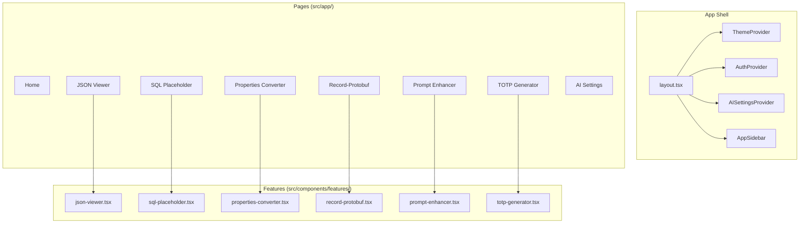

# CodeLessShipMore - Project Overview

A collection of developer utilities built with Next.js 16, React 19, and the Vercel AI SDK.

## 1. Stack

| Layer | Technology |
|-------|-------------|
| Framework | Next.js 16 App Router |
| UI | React 19, TypeScript (strict) |
| Styling | Tailwind CSS v4, shadcn/ui |
| AI | Vercel AI SDK with multi-provider support |
| State | React Context + localStorage |
| Package Manager | Bun |

### Development Commands

```bash
bun run dev      # Start dev server on http://localhost:3001
bun run build    # Production build
bun run lint     # ESLint check
bun run start    # Production server
```

## 2. Architecture Overview



## 3. Key Systems

### 3.1 AI Provider System

Profile-first architecture where each profile (Personal, Work, etc.) owns isolated provider configurations.

**Key Files:**
- `src/contexts/ai-settings-context.tsx` — Profile CRUD, provider management, encrypted key handling
- `src/lib/ai/providers.ts` — Built-in provider catalog, defaults, metadata
- `src/hooks/use-ai.ts` — Runtime adapter exposing `generate`, `chat`, `streamGenerate`

**Supported Providers:**
- Anthropic (Claude)
- Google (Gemini)
- OpenAI
- OpenAI-compatible custom providers

### 3.2 Storage Model

Browser-only persistence via localStorage with three buckets:
- `profiles` — Workspace configurations
- `provider-configs` — Provider settings (scoped to profile)
- `app-metadata` — App state

**Key Files:**
- `src/lib/storage/storage-provider.ts` — Interface
- `src/lib/storage/local-storage-provider.ts` — Implementation
- `src/lib/storage/local-storage-migration.ts` — IndexedDB migration

### 3.3 Secret Handling

API keys encrypted at rest with AES-GCM:
- `src/lib/ai/encryption.ts` — Encryption utilities
- Keys decrypted on-demand via `getDecryptedApiKey`
- Never stored in plaintext

## 4. Directory Structure

```
src/
├── app/                    # Next.js App Router pages
│   ├── page.tsx           # Home
│   ├── json-viewer/       # JSON formatting tool
│   ├── sql-placeholder/   # SQL placeholder generator
│   ├── properties-converter/
│   ├── record-protobuf/
│   ├── enhance-prompt/    # AI prompt enhancement
│   ├── totp-generator/    # TOTP code manager
│   └── settings/          # AI provider settings
├── components/
│   ├── features/          # Feature-specific components
│   └── ui/                # Shared shadcn/ui components
├── contexts/              # React contexts
├── hooks/                 # Custom hooks
├── lib/
│   ├── ai/               # AI providers, encryption
│   └── storage/          # Persistence layer
└── types/                # TypeScript types
```

## 5. Conventions

| Convention | Rule |
|------------|------|
| Imports | Use `@/*` path alias for `src/` |
| State | Extend existing contexts/hooks; no parallel state |
| Storage | Use storage abstractions; no direct localStorage |
| AI Changes | Verify config-time (`AISettingsProvider`) and runtime (`useAI()`) |
| Package Manager | Always use `bun` |

## 6. Developer Tools

| Tool | Page | Purpose |
|------|------|---------|
| JSON Viewer | `/json-viewer` | Format and inspect JSON |
| SQL Placeholder | `/sql-placeholder` | Generate SQL placeholders |
| Properties Converter | `/properties-converter` | Convert properties formats |
| Record-Protobuf | `/record-protobuf` | Record to Protobuf conversion |
| Prompt Enhancer | `/enhance-prompt` | AI-powered prompt improvement |
| TOTP Generator | `/totp-generator` | Manage TOTP codes locally |
| AI Settings | `/settings` | Configure AI providers per profile |

## 7. References

- `CLAUDE.md` — Claude Code guidance
- `AGENTS.md` — Agent-specific instructions
- `package.json` — Dependencies and scripts
